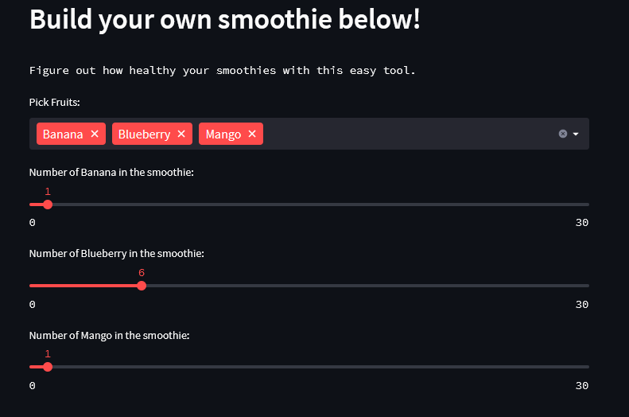

# Smoothie Nutrition Calculator 

### Problem: Want to find out how different smoothies compare when making them at home? 

### Solution: Tom's Fruit Smoothie App 

Now you can figure out what the best combo is! Provides info on the approximate sugar, carb, fat, calorie, and protein values of a smoothie are based on their fruit content. Any liquid additions to your smoothie are usually easy to figure out as nutrient information is provided.

#### Simple app exploring Streamlit functionality and calling APIs with Python using the FruityVice API and some additional data from Health Canada.

https://www.fruityvice.com/

To get started, access the app below:
https://thomaslillo-smoothienutritioncalculator-streamlit-app-6fawcn.streamlitapp.com/

## Screenshots of the App

